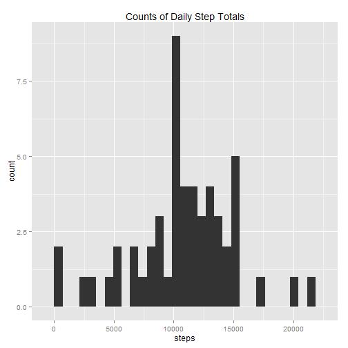
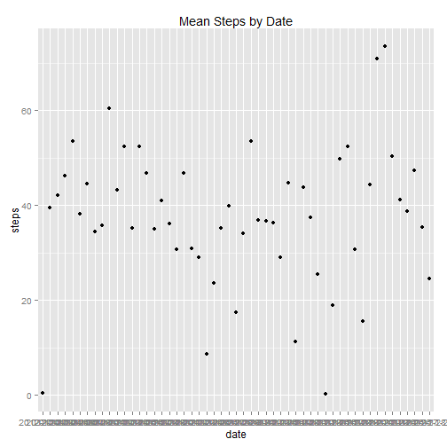
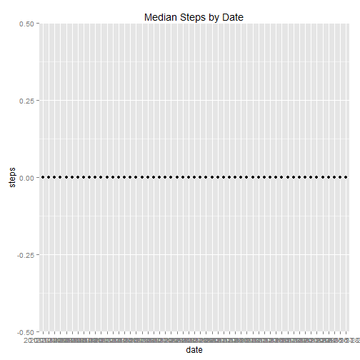
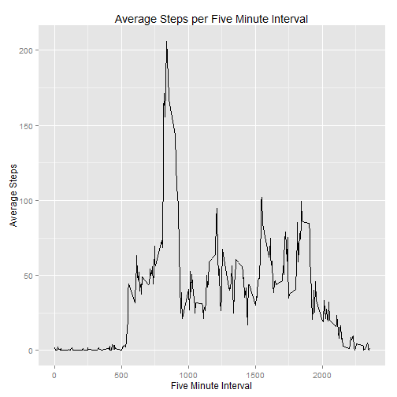
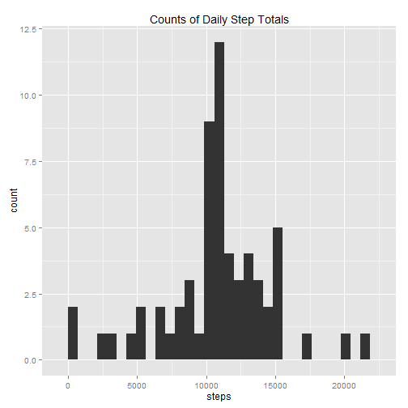
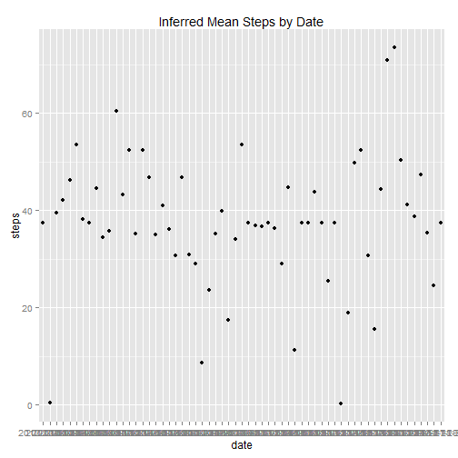
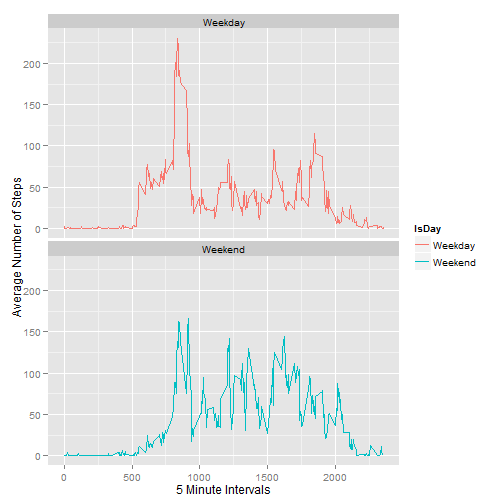

The purpose of this study is to answer several questions regarding steps taken by one individual wearing an activity monitoring device. This device collected motion data at 5 minute intervals daily for two months.  These data were collected during October and November, 2012. 

<ul>
<li>The original collected dataset used for this study is published here: (https://d396qusza40orc.cloudfront.net/repdata%2Fdata%2Factivity.zip).</li>
<li>For this study, the dataset was downloaded on 10/17/2014.</li>
</ul>
The questions to answer are:
<ol>
<li>What are the mean and median steps per day?</li>
<li>What is the average daily pattern?</li>
<li>How to handle missing values using approximations?  What impact does this technique have our our studies?</li>
<li>Are there differences in activity patterns between weekdays and weekends?</li>
</ol>

_______________________________
<h3>Prep Step: Get data if you need it</h3>

```r
## First step - download if you don't have the file. This code that checks for the dataset, downloads and unzips it as necessary.
## Uncomment and run the below lines if you need to get the data
# WD <- getwd()
# if {(!is.null(WD)) setwd(WD)}
# check for dataset, download and unzip as necessary
# if {(!file.exists("activity.csv"))
#         download.file("https://d396qusza40orc.cloudfront.net/repdata%2Fdata%2Factivity.zip", "activity.zip" )
#         unzip("activity.zip")
```
<h3>Step 1: Load libraries and pull data into a dataframe for R

```r
require(knitr)
require(reshape2)
```

```
## Loading required package: reshape2
```

```r
require(ggplot2)
```

```
## Loading required package: ggplot2
```

```r
require(plyr)
```

```
## Loading required package: plyr
```

```r
ActivityDF <- read.csv("activity.csv", header = TRUE)
```
<h3>Question 1: Make a histogram of the total number of steps taken each day

```r
StepsByDateDF <- aggregate(steps ~ date, ActivityDF, FUN=sum, na.rm=FALSE)
qplot(steps, data = StepsByDateDF, main="Counts of Daily Step Totals", geom="histogram")
```

```
## stat_bin: binwidth defaulted to range/30. Use 'binwidth = x' to adjust this.
```

 
<h3>Question 1: What are the mean and median steps per day?</h3>

Mean

```r
StepsMeanByDateDF <- aggregate(steps ~ date, ActivityDF, FUN=mean, na.rm=FALSE)
qplot(date, steps, data=StepsMeanByDateDF, 
        main = "Mean Steps by Date")
```

 

Median - much less interesting due to "unavailable data"

```r
StepsMedianByDateDF <- aggregate(steps ~ date, ActivityDF, FUN=median, na.rm=FALSE)
qplot(date, steps, data=StepsMedianByDateDF, 
      main = "Median Steps by Date")
```

 
<h3>Question 2: What is the average daily pattern?

```r
## create pivot of average steps per interval across all days
FiveMinIntDF<- melt(tapply(ActivityDF$steps, INDEX=ActivityDF$interval, 
                FUN=mean, na.rm=TRUE), 
                variable.name = "interval", value.name = "steps")

# give var1 a meaningful name
names(FiveMinIntDF)[names(FiveMinIntDF)=="Var1"] <- "interval"


ggplot(FiveMinIntDF, aes(interval,steps)) + geom_line(lwd=.4) + 
        scale_x_continuous("Five Minute Interval") + 
        scale_y_continuous("Average Steps") +
        labs(title = "Average Steps per Five Minute Interval")
```

 
<h3>Question 2: What is the largest average number of steps in a five minute interval?

```r
max(FiveMinIntDF$steps)
```

```
## [1] 206.1698
```
<h3>Question 3: Find the number of missing values

```r
sum(is.na(ActivityDF$steps))
```

```
## [1] 2304
```
<h3> Question 3: Devise a strategy to add reasonable approximate data to the Activity data in new, "inferred" dataset.</h3>
<ol>
<li> Create a copy of ActivityDF dataset called ActivityInferredDF</li>
<li> Use the averages per interval calculated in FiveMinIntDF</li>
<li> Replace the NA's in the ActivityInferredDF dataset with the average steps for that specific interval in FiveMinIntDF</li>
</ol>

```r
#fill in the NA's with averages computed already in FiveMinIntDF
FillInNAsWithAvg <- function(ActivityDF, FiveMinIntDF){
        for (i in 1:nrow(ActivityDF)){
                if (is.na(ActivityDF[i,"steps"])){
                        ActivityDF[i,"steps"] = 
                        round(FiveMinIntDF[as.character(FiveMinIntDF$interval) == 
                        as.character(ActivityDF[i,"interval"]),"steps"])
                }
        }
        ActivityDF   
}
ActivityInferredDF <- FillInNAsWithAvg(ActivityDF, FiveMinIntDF)
```
<h3>Question 3: Generate a histogram of the total number of steps taken each day with the inferred data</h3>

```r
InferredStepsByDateDF <- aggregate(steps ~ date, ActivityInferredDF, 
                           FUN=sum, na.rm=FALSE)
qplot(steps, data = InferredStepsByDateDF, main="Counts of Daily Step Totals", geom="histogram")
```

```
## stat_bin: binwidth defaulted to range/30. Use 'binwidth = x' to adjust this.
```

 
<h3>Question 3: What are the Mean and Median for the inferred steps per day? </h3>
Mean

```r
mean(InferredStepsByDateDF$steps)
```

```
## [1] 10765.64
```

```r
StepsMeanByDateInfDF <- aggregate(steps ~ date, ActivityInferredDF, 
                                FUN=mean, na.rm=FALSE)
qplot(date, steps, data=StepsMeanByDateInfDF, 
       main = "Inferred Mean Steps by Date")
```

 
Median

```r
median(InferredStepsByDateDF$steps)
```

```
## [1] 10762
```
<h3>Question 3: What impact did inferring data have?</h3>
Rendering summary statistics before and after the inference

```r
summary(StepsMeanByDateDF)
```

```
##          date        steps        
##  2012-10-02: 1   Min.   : 0.1424  
##  2012-10-03: 1   1st Qu.:30.6979  
##  2012-10-04: 1   Median :37.3785  
##  2012-10-05: 1   Mean   :37.3826  
##  2012-10-06: 1   3rd Qu.:46.1597  
##  2012-10-07: 1   Max.   :73.5903  
##  (Other)   :47
```

```r
summary(StepsMeanByDateInfDF)
```

```
##          date        steps        
##  2012-10-01: 1   Min.   : 0.1424  
##  2012-10-02: 1   1st Qu.:34.0938  
##  2012-10-03: 1   Median :37.3681  
##  2012-10-04: 1   Mean   :37.3807  
##  2012-10-05: 1   3rd Qu.:44.4826  
##  2012-10-06: 1   Max.   :73.5903  
##  (Other)   :55
```
<ol>
<li>The counts of 10,000 and 11,000 step intervals (busy times) increased</li>
<li>The overall shape of the data remained the same</li>
<li>The mean and median are the same</li>
<li>2,304 cases were inferred as shown below:</li>

```r
before<- complete.cases(ActivityDF)
after<- complete.cases(ActivityInferredDF)
table(before)
```

```
## before
## FALSE  TRUE 
##  2304 15264
```

```r
table(after)
```

```
## after
##  TRUE 
## 17568
```
<h3>Question 4: Are there differences in activity patterns between weekdays and weekends?</h3>

```r
# Add a factor column to denote weekday or weekend 
ActivityInferredDF$IsDay <- as.factor(ifelse(weekdays(as.Date
                                (ActivityInferredDF$date)) %in% c("Saturday","Sunday"),
                                "Weekend", "Weekday")) 
# ## Recreate dataframe of mean steps per interval with weekday/weekend info
FiveMinIntDF <- aggregate(steps~interval + IsDay, ActivityInferredDF,
                          FUN=mean)

ggplot(data = FiveMinIntDF, aes(x = interval, y = steps, group = IsDay)) + geom_line(lwd=.3) + 
        geom_line(aes(color = IsDay)) +
        facet_wrap(~ IsDay, nrow=2) + 
        scale_x_continuous("5 Minute Intervals") + 
        scale_y_continuous("Average Number of Steps")
```

 
